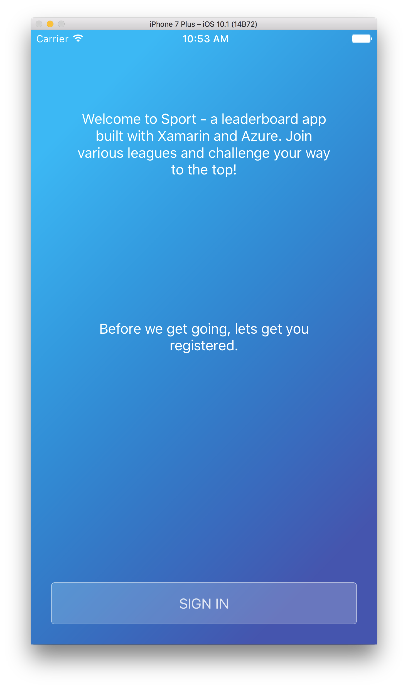
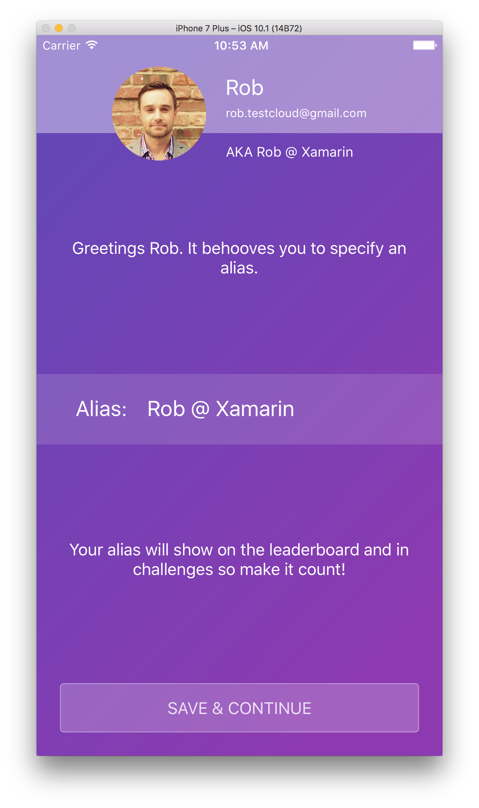
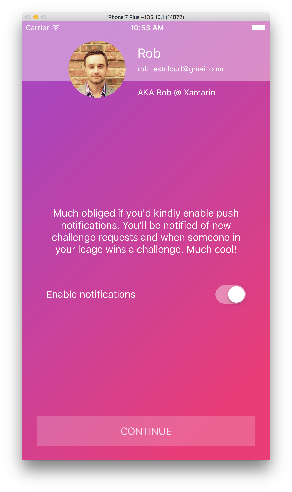
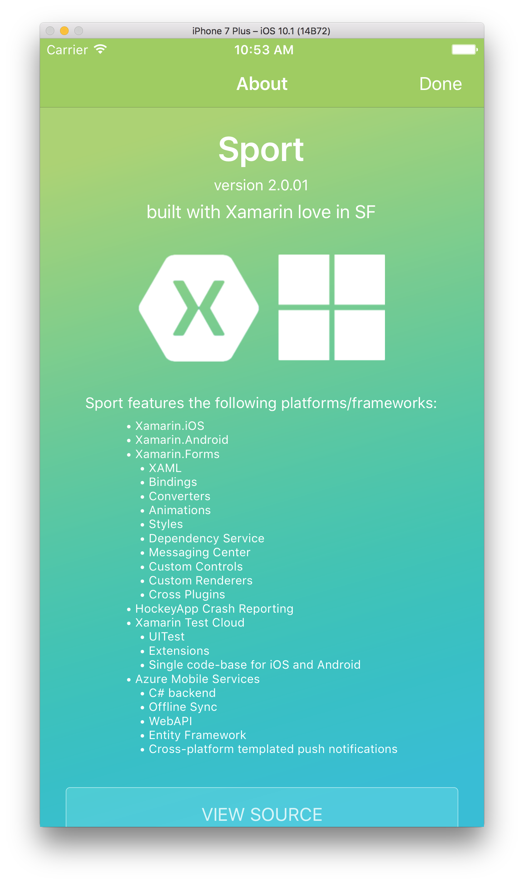
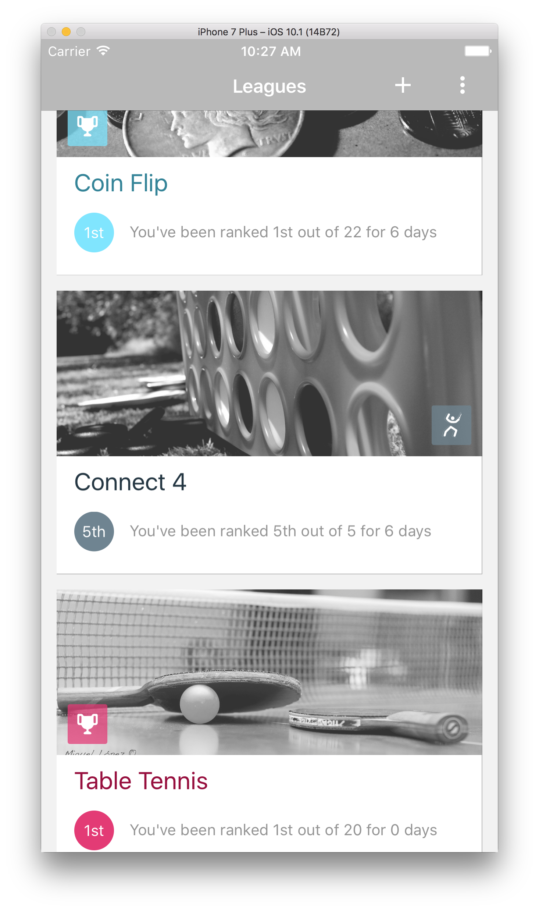
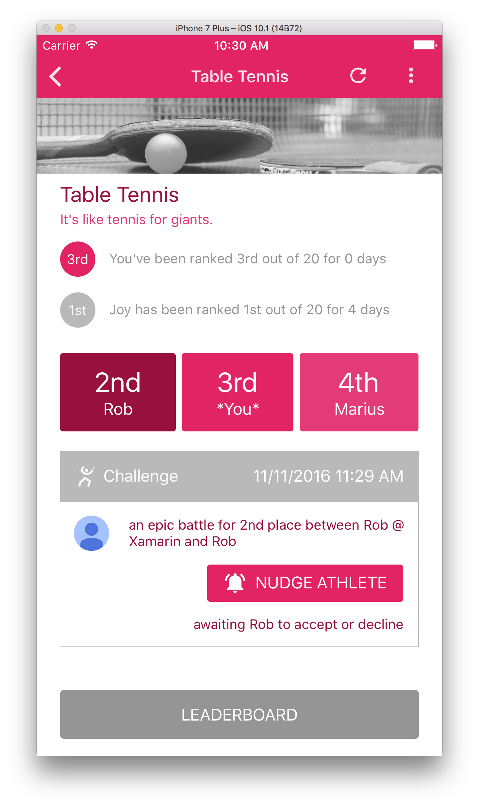
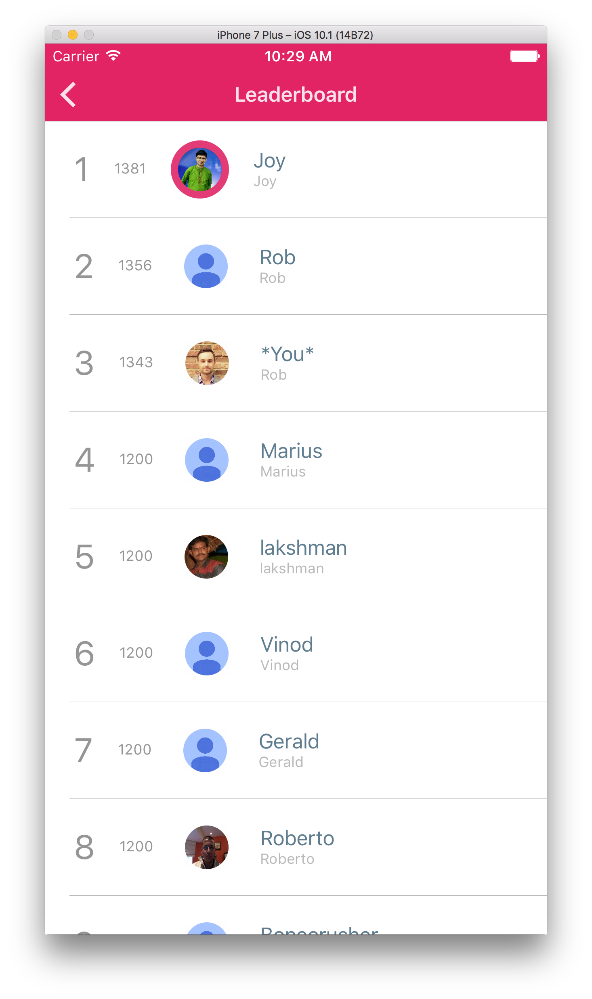
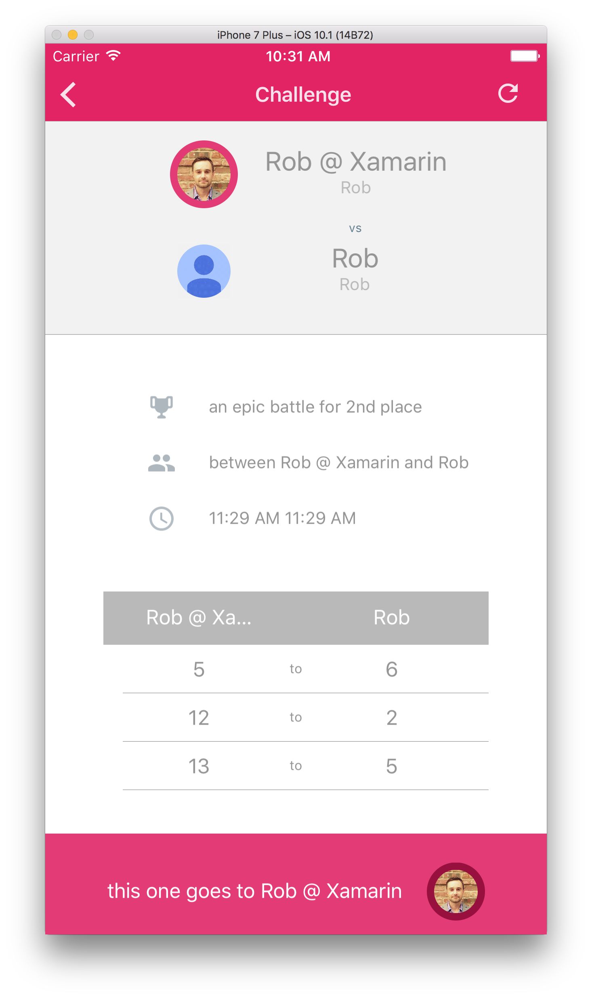

# Sport

Sport is a Xamarin.Forms app initially built for Xamarin employees as a way to facilitate leaderboards for a few ping-pong tables and darts we have around the office. Athletes can join leagues, get ranked and challenge other athletes to move up the ladder.

Sport employs the [Elo Rating System](https://en.wikipedia.org/wiki/Elo_rating_system). Each new member of a league initially starts with a rating of 1200. Anyone can challenge anyone, above or below you in the ladder and you can have multiple challenges in play. The larger the delta between the two players will result in how significant your rating increases or decreases. Victor over an athlete with a much higher rating than yours and you'll see a nice bump in your rating.

As of 11/11/2016, Sport features 93.6% code share (3.3% iOS / 3.1% Android).

[This is an example of an iOS athlete and an Android athlete conducting a challenge](https://www.youtube.com/watch?v=GmdvxDVluRA)

#### This project exercises the following platforms, frameworks or features:
* Xamarin.iOS
* Xamarin.Android
* Xamarin.Forms
  * XAML
  * Bindings
  * Converters
  * Central Styles
  * Custom Renderers
  * Animations
  * IoC
  * Messaging Center
  * Custom Controls
  * Cross Plugins
  * XFGloss
* HockeyApp Crash Reporting
* Xamarin Test Cloud
  * UITest
  * Extensions
  * Single code-base for iOS & Android
* Azure Mobile Services
  * C# backend
  * WebAPI
  * Entity Framework
  * Offline Sync
  * Cross-platform templated push notifications

#### This project employs a few patterns listed below:
* Enforces a ViewModel-per-Page concept
  * all `ContentPage` classes enforce a generic `BaseViewModel` type
  * automatically set as the binding context
* All tasks are proxied through a `RunSafe` method
  * verifies connectivity
  * gracefully handles and reports exceptions
* Leagues are assigned a randomly selected themed color at runtime

#### Keys
* Default keys have been provided to connect to an existing Azure instance
  * You will need to create your own app in Google Developer Console to generate a GCM Sender ID if you wish to test out push notifications
* If you wish to stand up your own backend, you will need to replace the existing fields in Keys.cs file for HockeyApp App IDs.
* To run the included UITest suite, you'll need to provide a test Google email address and password

#### Notes
* You will need a valid Google account to log into the application
* Parallax feature should be tested on a device - simulator will cause jitter

#### Copyright and license
* Code and documentation copyright 2017 Microsoft Corp. Code released under the [MIT license](https://opensource.org/licenses/MIT)
